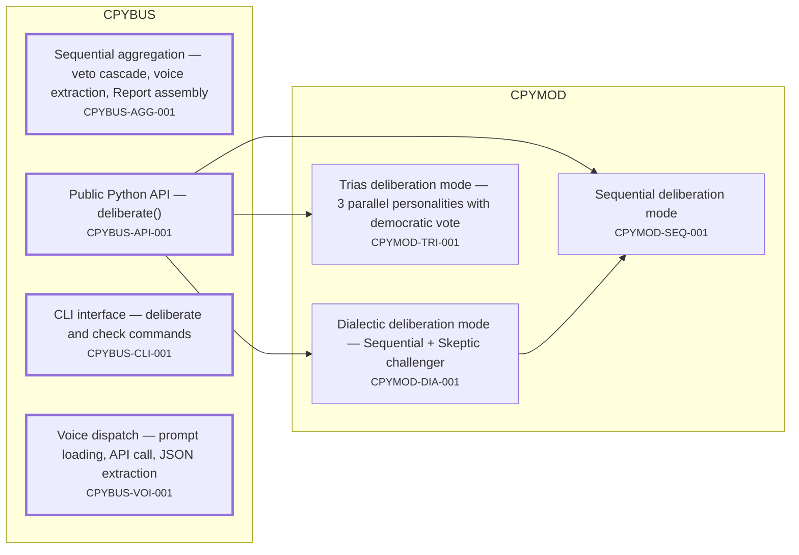
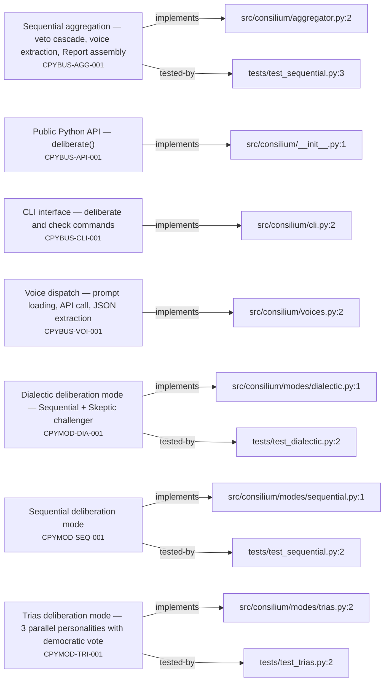
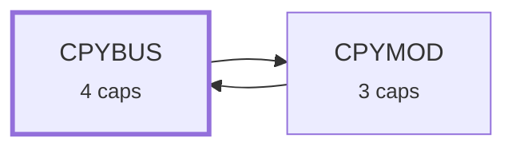
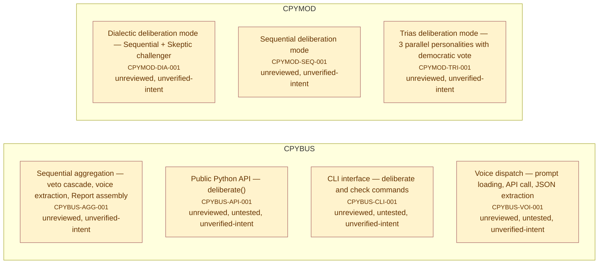

# Requirement Map

## System Map

_Capabilities grouped by area; thick border = bus; arrows = `depends_on`. Edges into the bus/hubs are hidden (the Dependency Map shows area-level coupling)._

## Requirement-to-Code

_Each requirement → its code; arrow label = role (`implements` / `tested-by`). Red = confirmed but no code linked (a gap); grey = baseline/draft, not linked yet (expected)._

## Dependency Map

_Area-level coupling: one box per area (N caps), arrow A->B = some capability in A depends on one in B. The System Map has the per-capability detail._

## Risk & Unknowns

_Requirements needing attention: red = unimplemented (confirmed, no code); orange = unreviewed (promote after review); yellow = untested (implemented but no tested-by — set `test_exempt` to silence), or unverified-intent (open verify-intent question)._

### Risk Table

| ID | status | members | dependents | risks | recommendation |
| --- | --- | --- | --- | --- | --- |
| CPYBUS-AGG-001 | baseline | 2 | 2 | unreviewed, unverified-intent | Draft/baseline, not yet validated: review the contract, wire its `tested-by` tests, then promote to `confirmed`. Until then it is tracked, not enforced. Has open `## WHAT — Verify intent` question(s): run `reqmap.py findings`, resolve each in `requirements/_findings.md`, then fold the answer into the Contract or delete the bullet. |
| CPYBUS-API-001 | baseline | 1 | 1 | unreviewed, untested, unverified-intent | Draft/baseline, not yet validated: review the contract, wire its `tested-by` tests, then promote to `confirmed`. Until then it is tracked, not enforced. Implemented but no `tested-by` member: write an acceptance test and tag it `# tested-by: <ID>`, or set `test_exempt: <reason>` in the frontmatter to acknowledge it intentionally and silence this signal. Has open `## WHAT — Verify intent` question(s): run `reqmap.py findings`, resolve each in `requirements/_findings.md`, then fold the answer into the Contract or delete the bullet. |
| CPYBUS-CLI-001 | baseline | 1 | 0 | unreviewed, untested, unverified-intent | Draft/baseline, not yet validated: review the contract, wire its `tested-by` tests, then promote to `confirmed`. Until then it is tracked, not enforced. Implemented but no `tested-by` member: write an acceptance test and tag it `# tested-by: <ID>`, or set `test_exempt: <reason>` in the frontmatter to acknowledge it intentionally and silence this signal. Has open `## WHAT — Verify intent` question(s): run `reqmap.py findings`, resolve each in `requirements/_findings.md`, then fold the answer into the Contract or delete the bullet. |
| CPYBUS-VOI-001 | baseline | 1 | 4 | unreviewed, untested, unverified-intent | Draft/baseline, not yet validated: review the contract, wire its `tested-by` tests, then promote to `confirmed`. Until then it is tracked, not enforced. Implemented but no `tested-by` member: write an acceptance test and tag it `# tested-by: <ID>`, or set `test_exempt: <reason>` in the frontmatter to acknowledge it intentionally and silence this signal. Has open `## WHAT — Verify intent` question(s): run `reqmap.py findings`, resolve each in `requirements/_findings.md`, then fold the answer into the Contract or delete the bullet. |
| CPYMOD-DIA-001 | baseline | 2 | 1 | unreviewed, unverified-intent | Draft/baseline, not yet validated: review the contract, wire its `tested-by` tests, then promote to `confirmed`. Until then it is tracked, not enforced. Has open `## WHAT — Verify intent` question(s): run `reqmap.py findings`, resolve each in `requirements/_findings.md`, then fold the answer into the Contract or delete the bullet. |
| CPYMOD-SEQ-001 | baseline | 2 | 2 | unreviewed, unverified-intent | Draft/baseline, not yet validated: review the contract, wire its `tested-by` tests, then promote to `confirmed`. Until then it is tracked, not enforced. Has open `## WHAT — Verify intent` question(s): run `reqmap.py findings`, resolve each in `requirements/_findings.md`, then fold the answer into the Contract or delete the bullet. |
| CPYMOD-TRI-001 | baseline | 2 | 1 | unreviewed, unverified-intent | Draft/baseline, not yet validated: review the contract, wire its `tested-by` tests, then promote to `confirmed`. Until then it is tracked, not enforced. Has open `## WHAT — Verify intent` question(s): run `reqmap.py findings`, resolve each in `requirements/_findings.md`, then fold the answer into the Contract or delete the bullet. |
